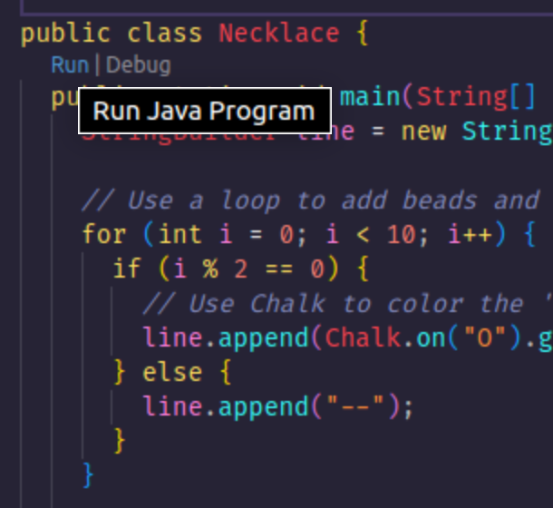

# Contributing

Great work on the deep dive. Now let's make some art!

## Drawings

### Necklace

1. Run `Necklace.java` and behold the beauty!

   You can do this either by clicking the `Run` button above the `main()` method
   in `Necklace.java`

   <p align="center">
    </img>
   </p>

   or in the terminal by running

   ```bash
   ./mvnw -q exec:java -Dexec.mainClass="com.corndel.pixmate.drawings.Necklace"
   ```

1. Take a look at `Necklace.java` to figure out what is going on.

1. Copy the code into a new `.java` file and hack around to make some different
   patterns. Have fun!

### Rectangle

1. Run `Rectangle.java` and marvel at the wonder!

1. Take a look a `Rectangle.java` and hack around to see how it works.

1. If you make something interesting, save it in a new file!

To make a 2D shape, you are using something called a "nested loop" - that is a
loop inside a loop. The outer loop iterates through the rows, and the inner loop
iterates through each row itself.

Could you make `Rectangle.java` into a function which accepts `width` and
`height` to make it more versatile?

### Triangle

Can you draw this?

```txt
*
**
***
****
*****
```

Can you make it a function with the number of rows as a parameter?

### Inverted triangle

How about this?

```txt
*****
****
***
**
*
```

### Triangle sandwich

And this?

```txt
*
**
***
****
*****
****
***
**
*
```

### Diagonal

These guys?

```txt
*
 *
  *
   *
    *
```

and

```txt
    *
   *
  *
 *
*
```

### Checkerboard

A bit trickier...

```txt
* * * * *
 * * * *
* * * * *
 * * * *
* * * * *
```

You'll need some conditional logic here.

### Keep going!

Draw whatever you like. Something useful. Something pretty. Get creative! Use
colour, pattern, functions, conditions... there are no rules.

## Animate

We've provided a class called `Animator` which accepts an array of strings. It
will print each frame with `interval` seconds in-between.

### Loading

Have a look at `animations/Loading.java` to see how `Animator.animate` can be
used.

We use a loop to build up a string and push it into a list of `frames`. We pass
this array to `animate` with the desired interval.

Here are some things to try:

- make `Loading` into a function to adjust the length of the loading bar
- add some colour with `Chalk`!
- add a message to each frame saying the current % completion

### More animations

Go ahead and make any more animations you like. Feel free to copy
`Animator.java` and hack it to change the animation behaviour if you like.

Some ideas:

- make two arrows crash into eachother and explode `--> <--`

- make a loading spinner with the symbols `-`, `\`, `|`, `/`

- make a twinkling night sky using `Math.random()`

(Hint: to make a 2D animation, you can put `\n` into a string to render a line
break.)
