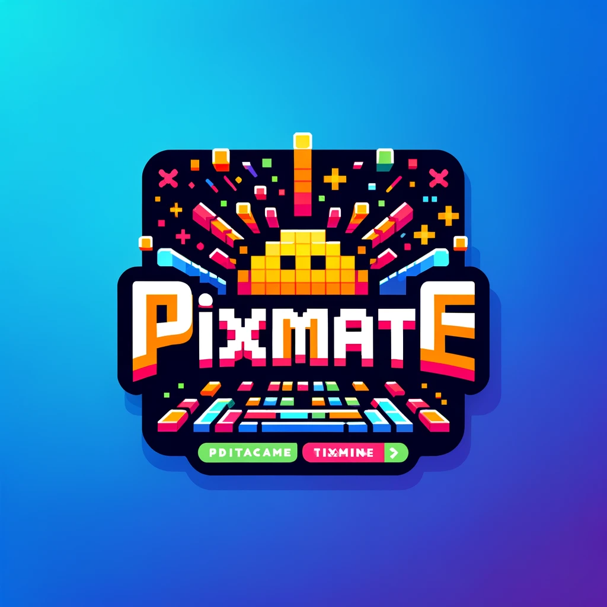
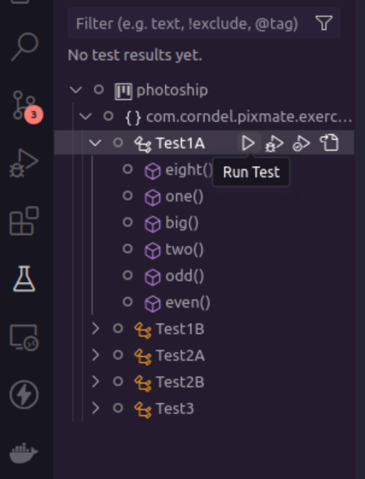
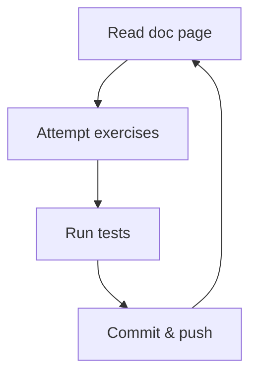

<p align="center">
  </img>
</p>

# PixMate

Welcome to PixMate!

The purpose of this repo is to make pixel art. We'll be using everything we've
learned so far, including arrays, strings and conditionals, along with a new
concept: loops.

```txt
     *
    ###
   *****
  #######
 *********
    ...
    ...
```

## Getting started

1. Make sure your machine is set up according to the instructions with

   - [bash](https://tech-docs.corndel.com/bash/)
   - [vscode](https://tech-docs.corndel.com/vscode/)
   - [git](https://tech-docs.corndel.com/git/)
   - [java and maven](https://tech-docs.corndel.com/java/installation.html)

1. Clone the repository (i.e. download it), so you have a copy on your machine:

   ```bash
   git clone <your-repository-url>
   ```

1. Once cloned, open a terminal in the project folder, and run

   ```bash
   ./mvnw clean compile
   ```

   to install dependencies.

## Running tests

To check if your solution for one of the exercises has worked, you can run the
tests.

You can choose from either method below:

### Option 1: Using VS Code

You can open up the "Testing" tab and press play on the test or group of tests
you want to run.

<p align="center">
  </img>
</p>

### Option 2: Using the CLI

To check if your solution for one of the exercises has worked, you can run the
command

```bash
./mvnw test
```

in the terminal.

> [!TIP]
>
> You can choose which test to run using the `-Dtest=` parameter. E.g. Runnning
>
> ```bash
> ./mvnw test -Dtest=Exercise1aTest
> ```
>
> in the terminal will test only the `Exercise1a.java` code using the
> `Exercise1aTest.java` test file.

## Deep dive

Before working on PixMate, there are a few things we need to learn. There are
some documentation pages which will teach you what you need to know, and some
exercises for you to practice your skills.



### Basic loops

1. Read the docs on
   [while loops](https://tech-docs.corndel.com/java/while-loops.html) and
   [for loops](https://tech-docs.corndel.com/java/for-loops.html).

1. Complete Exercise 1a:

   - Run the tests in to see if you got it right!

   - Once you pass the tests, type `git commit -am "Solves 1a"` in the terminal
     and hit enter to commit your solution.

   - Now run `git push` to sync your changes to github.

1. Read the docs on
   [for of loops](https://tech-docs.corndel.com/java/for-each-loops.html).

1. Solve, commit and push Exercise 1b.

### Loop control flow

1. Read the docs on
   [control flow](https://tech-docs.corndel.com/java/loop-control-flow.html).

1. Solve, commit and push Exercise 2a.

1. Solve, commit and push Exercise 2b.

### Nested loops

1. Read the docs on
   [applied iteration](https://tech-docs.corndel.com/java/nested-loops.html).

1. Solve, commit and push Exercise 3.

## Moving on

Great job! With the deep dive taken care of, we're ready to make some art.

Find `CONTRIBUTING.md` to find out what to do.
